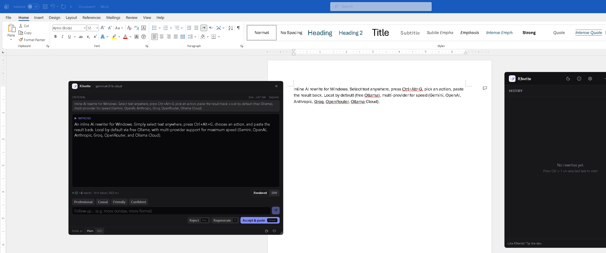
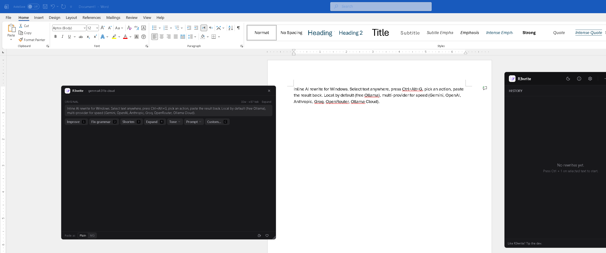
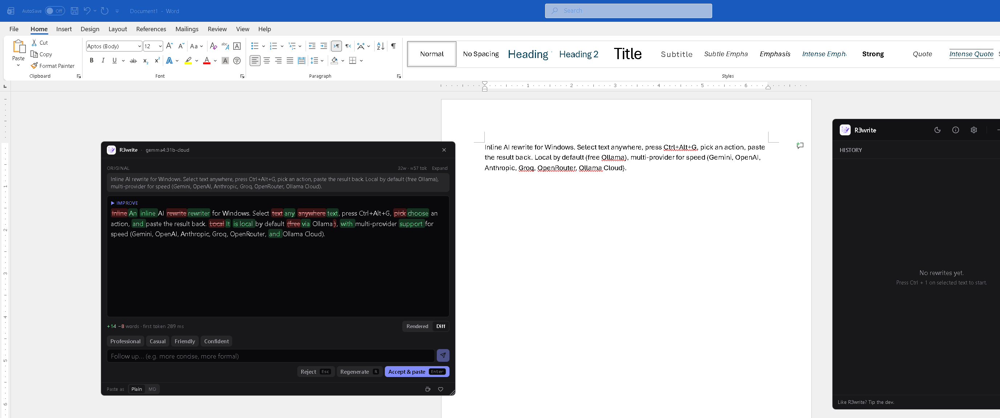
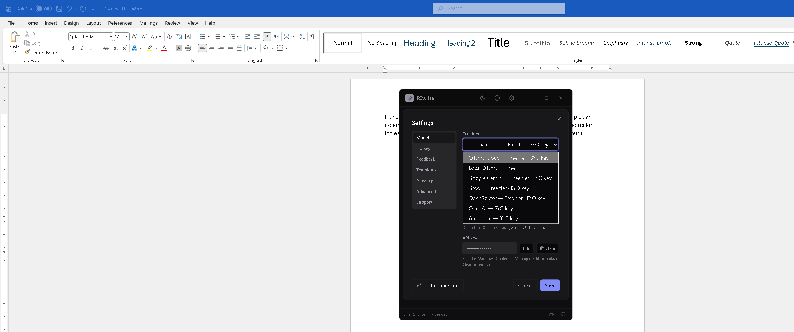
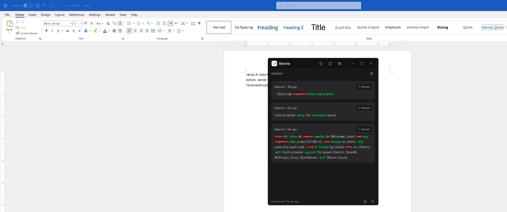

<p align="center">
  
</p>

<h1 align="center">R3write</h1>

<p align="center">
  <strong>Inline AI rewrite for Windows.</strong><br/>
  Select text in any app. Press <kbd>Ctrl</kbd> + <kbd>Alt</kbd> + <kbd>G</kbd>. Pick an action. Paste the result back.<br/>
  Local-by-default with free Ollama, multi-provider for speed — Gemini, OpenAI, Anthropic, Groq, OpenRouter, Ollama Cloud.
</p>

<p align="center">
  <a href="https://drknowhow.github.io/R3write/"><strong>Website &rarr;</strong></a> &nbsp;·&nbsp;
  <a href="https://github.com/drknowhow/R3write/releases/latest">Download</a> &nbsp;·&nbsp;
  <a href="./CHANGELOG.md">Changelog</a>
</p>

<p align="center">
  <a href="https://github.com/drknowhow/R3write/releases/latest"></a>
  
  
  
</p>

---

<p align="center">
  
</p>

<p align="center">
  <em>Select text in Word, the popup streams an Improve rewrite, you Accept &amp; paste — every keystroke without leaving the source app.</em>
</p>

## Why R3write

- **Inline, not a tab.** No window-switching. The rewrite happens where you're already typing.
- **Free by default.** Local Ollama is the zero-cost path — no key, no quota, no network. Cloud providers are opt-in for speed or quality.
- **Bring your own key.** Every cloud provider uses your own API key, stored per-provider in Windows Credential Manager — never on disk in plain text, never proxied through anyone else's server.
- **Word-level diff.** See exactly what changed, every time. Green additions, red deletions, on the same surface where you accepted the rewrite.

## Quick install

**Download the installer** &nbsp;→&nbsp; [`R3write_<version>_x64-setup.exe`](https://github.com/drknowhow/R3write/releases/latest) &nbsp; *(unsigned NSIS, ~3.6 MB)*

**Or build from source:**

```powershell
git clone https://github.com/drknowhow/R3write
cd R3write
npm install
npm run tauri:dev
```

**Prerequisites:** Windows 10/11 · Node ≥ 20 · Rust stable + MSVC Build Tools · WebView2 (preinstalled on recent Windows).

On first launch a four-step onboarding shows you where to set up a provider. Default is Ollama Cloud (free tier); switch to Local Ollama for zero-cost local inference or any of the other five cloud providers from `Settings → Model → Provider`.

---

## What's in it

### One hotkey, any app

<p align="center">
  
</p>

Word, Slack, browsers, code editors, terminals — anywhere there's text. The popup opens at your cursor with `Improve` / `Fix grammar` / `Shorten` / `Expand` / `Tone` / `Prompt` / `Custom`. Each chip has a numeric shortcut (`1`-`4`, `C`) so you never need the mouse. Pick one and the rewrite streams in.

Repeat the same action on a new selection with <kbd>Ctrl</kbd> + <kbd>Alt</kbd> + <kbd>Shift</kbd> + <kbd>G</kbd> — no picker, no clicks.

### Word-level diff

<p align="center">
  
</p>

Toggle the rewrite into `Diff` view to see exactly what changed: green for additions, red strike-through for deletions, with a running `+N -M words` tally and the first-token latency. Sanitised for both light and dark themes.

### Your providers, your keys

<p align="center">
  
</p>

| Provider | Tier | Default model | Notes |
|---|---|---|---|
| **Local Ollama** | Free | `llama3.2` | runs on your machine, no key |
| **Ollama Cloud** | Free tier · BYO key | `gemma4:31b-cloud` | default for new installs |
| **Google Gemini** | Free tier · BYO key | `gemini-2.5-flash` | most generous free tier; very fast |
| **Groq** | Free tier · BYO key | `llama-3.3-70b-versatile` | fastest streaming token rate |
| **OpenRouter** | Free tier · BYO key | `anthropic/claude-sonnet-4` | aggregator, many models |
| **OpenAI** | BYO key | `gpt-4.1-mini` | paid only |
| **Anthropic** | BYO key | `claude-sonnet-4-6` | paid only |

Each provider has its own keyring entry in Windows Credential Manager. Switch providers and the others' keys stay put. A live status pill in the header polls the active provider every 60 s — green/amber/red.

### History at a glance

<p align="center">
  
</p>

Last 20 rewrites with action, time, word-level diff, and one-click Revert (copies the original back to your clipboard for paste-over-the-rewrite). Closing the main window keeps R3write running in the system tray so the global hotkey still fires.

---

## Power features

- **Saved templates** &mdash; name your common custom prompts in `Settings → Templates`; they surface as a popup dropdown next to `Tone` / `Prompt` / `Custom`.
- **Recent custom prompts** &mdash; last 12 surface as one-click chips beneath the custom-prompt input.
- **Glossary &amp; protected terms** &mdash; `Settings → Glossary` appends a persistent style guide to every system prompt and locks listed terms (names, identifiers, brand strings) so the model preserves them verbatim.
- **Paste-as toggle** &mdash; `Plain` strips Markdown for clean prose; `MD` preserves Markdown for Slack, Discord, code editors. Choice persists.
- **Three Prompt actions** for rewriting LLM/agent prompts &mdash; `Compress tokens` / `Distill intent` / `Structure for agents`. None invent new requirements.
- **Multi-turn refinement** &mdash; follow up with "more concise", "less formal", etc. Context is capped to `system + first turn + last assistant + new user` so cycles don't compound token cost.
- **Educational + Affirmation channels** (optional) &mdash; the model adds a "Why this works" note or a one-line encouragement, in a side-card. Excluded from paste-back and history.
- **Customisable hotkeys** &mdash; rebind both the main hotkey and every in-popup shortcut.
- **Autostart at login** &mdash; toggle in `Settings → Advanced` (writes the Windows per-user `Run` registry key).
- **Export history** as JSON or Markdown from `Settings → Advanced`.
- **System / light / dark theme** with manual override, pre-hydration boot script (no flash), View Transitions API crossfade where supported.
- **First-run onboarding** &mdash; four-step walkthrough and one-click jump to Settings.

## How it works under the hood

R3write is a two-window Tauri 2 app:

- **Main window** &mdash; history list, status pill, settings, system tray host.
- **Quick-edit popup** &mdash; frameless `alwaysOnTop` window, pre-mounted, shown at cursor.

The hotkey handler in Rust shows the popup immediately with a `Capturing…` placeholder, then runs the clipboard dance in a background thread (release modifiers, write sentinel, simulate `Ctrl+C`, poll for clipboard change, restore original). The captured text streams to the popup; the popup makes a single streaming request to the active provider via `tauri-plugin-http` and writes tokens directly to the DOM via `requestAnimationFrame` (so React re-renders stay at ~3 per response).

Each window loads its own HTML and JS entry (`index.html` + `quick-edit.html`) so the popup ships only what it needs &mdash; cold-start parse cost stays small even as the main window grows new tabs.

## Stack

- **Tauri 2** (Rust) &mdash; Windows shell, NSIS installer
- **React 18 + TypeScript + Vite + Tailwind v4** &mdash; frontend
- **Multi-page Vite build** &mdash; separate entries per window
- **Radix UI + Framer Motion + Lucide React** &mdash; accessible primitives, animations, icons
- **`marked` + `DOMPurify` + `diff`** &mdash; Markdown rendering and inline diff
- **enigo** &mdash; keyboard simulation for `Ctrl+C` / `Ctrl+V` capture and paste-back
- **keyring (windows-native)** &mdash; per-provider API key storage

## Configuration

Settings persist in `localStorage` under `r3write.settings.v1`; API keys live in Windows Credential Manager (`service: R3write`, `account: r3write-api-key-<provider>` or the legacy `ollama-api-key` for Ollama Cloud). The full schema lives in `DEFAULT_SETTINGS` in [`src/main.tsx`](src/main.tsx); the most user-facing fields:

| Field | Default | Notes |
|---|---|---|
| `provider` | `ollama-cloud` | Any of the seven providers; legacy `cloud` / `local` migrate on first load. |
| `model` | provider-dependent | Any model name your provider serves. |
| `hotkey` | `Ctrl+Alt+G` | Repeat-last uses the same combo + Shift. |
| `viewMode` | `rendered` | `rendered` or `diff` &mdash; persisted. |
| `pasteFormat` | `plain` | `plain` strips Markdown on Accept; `markdown` keeps it. |
| `savedTemplates` | `[]` | Named custom prompts shown in the popup. |
| `styleGuide` | `""` | Appended to every system prompt. |
| `protectedTerms` | `""` | Comma- or newline-separated; preserved verbatim. |
| `clickOutsideDismiss` | `true` | Closes the popup on window-blur (drag-safe). |
| `autostart` | `false` | Mirrors the Windows per-user `Run` registry value. |

Theme preference is stored under `r3write.theme.v1` and applied pre-hydration; history under `r3write.history.v1` (last 20 entries).

## Build a release installer

```powershell
npm run tauri:build
```

NSIS installer lands in `src-tauri/target/release/bundle/nsis/R3write_<version>_x64-setup.exe`. Code signing isn't wired up &mdash; Windows SmartScreen will warn on install until the build is signed (Azure Trusted Signing is the recommended modern path).

## Layout

```
R3write/
├── README.md
├── CHANGELOG.md
├── docs/
│   ├── banner.png
│   └── screenshots/             # the shots used above
├── index.html                   # main window — pre-hydration theme boot
├── quick-edit.html              # popup window — pre-hydration theme boot
├── vite.config.ts               # multi-page input (main + quick-edit)
├── src/
│   ├── entry-main.tsx           # renders <App />
│   ├── entry-quick-edit.tsx     # renders <QuickEdit />
│   ├── main.tsx                 # App, QuickEdit, provider clients, dialogs
│   ├── theme.ts                 # useTheme() hook, View Transitions crossfade
│   └── index.css                # Tailwind + design tokens + prose styles
└── src-tauri/
    ├── Cargo.toml
    ├── tauri.conf.json          # two windows: main + quick-edit
    ├── capabilities/default.json
    └── src/main.rs              # hotkeys + capture + paste-back + autostart + keyring
```

## About

R3write started as a personal itch: every time I needed to clean up a paragraph, tighten a Slack message, or rewrite a sentence I'd just typed, I'd <kbd>Alt</kbd>+<kbd>Tab</kbd> into a chatbot, paste the text, copy the response back, switch back, and lose my train of thought. For the small rewrites I do constantly, a 30-second chat is overkill.

R3write replaces the tab switch with a hotkey. Select text in any app, press <kbd>Ctrl</kbd>+<kbd>Alt</kbd>+<kbd>G</kbd>, pick an action, paste back. The rewrite happens where you're already typing.

### Principles

- **Local by default.** The free path uses Ollama on your machine. No network, no key, no quota.
- **Bring your own key.** Every cloud provider uses your API key directly. R3write doesn't proxy anything through its own server. There *is* no R3write server.
- **No telemetry.** R3write doesn't phone home, doesn't track usage, doesn't collect analytics.
- **Your data stays where you put it.** Selections go to the provider you configured. That's it.

### Built by

[@drknowhow](https://github.com/drknowhow). Issues, ideas, and PRs welcome on [GitHub](https://github.com/drknowhow/R3write/issues).

If R3write saves you time, you can [buy me a coffee](https://buymeacoffee.com/drknowhow) or [sponsor on GitHub](https://github.com/sponsors/drknowhow).

## Known limitations

- Quick-edit relies on the OS handing focus back to the previous app ~90 ms after the popup hides. Most apps cope; some Electron apps with custom focus handling may not.
- No single-instance lock or auto-updater yet (autostart is shipped).
- Code signing isn't configured; Windows SmartScreen will warn on install.
- Popup is anchored to the mouse, not the text caret &mdash; keyboard-only users may see it land somewhere unrelated. Caret-anchored positioning is tracked for a future release.

## Changelog

Full history in [`CHANGELOG.md`](./CHANGELOG.md). Latest: **1.3.0** &mdash; Google Gemini provider and the provider tier taxonomy.

## License

TBD.
